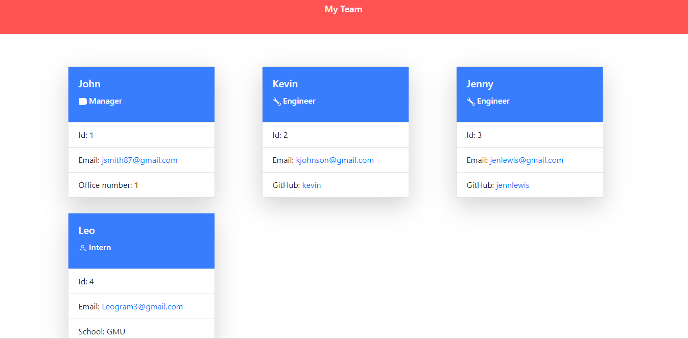

# Team-Profile-Generator

## Description

The purpose of this assignment is to create a team generator application including manager, engineer, and intern. For each position, the name, id, and email were included. The application will ask the user about the employee and team member information. Once all the input has been placed and the team is formed, the application will create an HTML file to display team members and their information.

## Installation

The Team-Profile-Generator was first created in repository in GitHub. The repository was cloned into local desktop. Any changes made to local was added, committed, and pushed to repository. This application uses Node, NPM, Inquirer and Jest.  

# Link to video
The below link is a video walkthrough for this application. 

Video link:  https://drive.google.com/file/d/1LWmGaKnf7jgU9DE81F9StQks0dOTzstv/view

# HTML
My HTML is in the dist file.

## Credits

I would like to thank Mike G. and Zia G. assisting me with this project. 

https://www.youtube.com/watch?v=K0vzRHZEsxc

https://www.youtube.com/watch?v=bJY3KfM77pc

https://jsonformatter.org/ 

## License

MIT License

Copyright (c) [] [ririhailu]

Permission is hereby granted, free of charge, to any person obtaining a copy
of this software and associated documentation files (the "Software"), to deal
in the Software without restriction, including without limitation the rights
to use, copy, modify, merge, publish, distribute, sublicense, and/or sell
copies of the Software, and to permit persons to whom the Software is
furnished to do so, subject to the following conditions:

The above copyright notice and this permission notice shall be included in all
copies or substantial portions of the Software.

THE SOFTWARE IS PROVIDED "AS IS", WITHOUT WARRANTY OF ANY KIND, EXPRESS OR
IMPLIED, INCLUDING BUT NOT LIMITED TO THE WARRANTIES OF MERCHANTABILITY,
FITNESS FOR A PARTICULAR PURPOSE AND NONINFRINGEMENT. IN NO EVENT SHALL THE
AUTHORS OR COPYRIGHT HOLDERS BE LIABLE FOR ANY CLAIM, DAMAGES OR OTHER
LIABILITY, WHETHER IN AN ACTION OF CONTRACT, TORT OR OTHERWISE, ARISING FROM,
OUT OF OR IN CONNECTION WITH THE SOFTWARE OR THE USE OR OTHER DEALINGS IN THE
SOFTWARE.

## Review  

* https://github.com/ririhailu/Team-Profile-Generator

  

